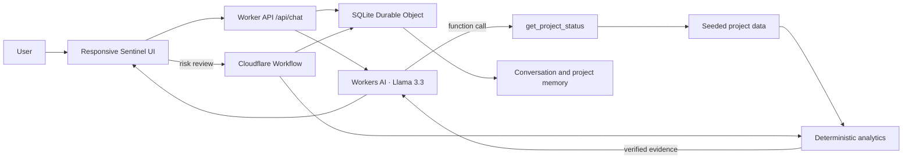

# Project Sentinel

**See the risk. Understand the cause. Act before it becomes a crisis.**

Project Sentinel is an AI project operations copilot for engineering teams. It turns project status, task dates, dependency links, capacity, cost, and saved decisions into a grounded conversation and a practical risk review.

## What it does

- Answers project questions through one chat interface.
- Calls the deterministic `get_project_status` tool before synthesizing project health answers with Cloudflare Workers AI and Llama 3.3 70B.
- Calculates schedule, cost, delay, and dependency signals in application code. The model explains verified values; it does not calculate or invent them.
- Remembers conversation turns and saved project notes in SQLite-backed Durable Object storage.
- Runs a durable Cloudflare Workflow for risk analysis, then saves its findings and suggested actions to project memory.
- Shows a responsive project overview, evidence cards, a dependency path, chat, agent activity, and recovery-plan draft.
- Includes a grounded response mode if Workers AI is unavailable during local development.

## Stack

- Cloudflare Workers: API and static asset delivery
- Workers AI: `@cf/meta/llama-3.3-70b-instruct-fp8-fast`
- Durable Objects with SQLite-backed storage: conversation history, project notes, and risk analysis results
- Cloudflare Workflows: durable, retryable project risk analysis
- TypeScript, semantic HTML, CSS, and browser JavaScript

## Architecture



### Request flow

1. The chat UI sends a message, project key, and conversation ID to `POST /api/chat`.
2. Llama 3.3 receives a `get_project_status` function schema and selects the relevant project tool.
3. Worker code executes that tool against the seeded dataset and computes metrics deterministically.
4. The Worker sends the tool result to Llama for a concise evidence-backed explanation.
5. The Worker stores the user and assistant turns in the Durable Object and returns the answer and evidence metadata.

If inference is unavailable, the same deterministic data supports a plain, grounded answer so the primary demo remains usable.

## Data and analytics

Seeded projects: Alpha (at risk), Beta (on track), and Gamma (watch). Alpha has a late integration milestone, seven tasks that missed target dates (five still open), three overdue dependency edges, 94% utilization, +12 days schedule variance, and +8.4% cost variance. Schedule variance is calculated from baseline and forecast completion dates; cost variance is calculated from actual cost and budget; task delays and blocked-dependency counts are derived from planned/actual dates and dependency IDs. The risk index is `round(scheduleDays × 1.5 + costVariancePercent + max(0, utilizationPercent − 70) × 0.75 + blockedDependencies × 4 + delayedTasks × 2)`, capped at 100; scores of 65+ are High and 30+ are Moderate. It is a deterministic heuristic, not a predictive model.

Recovery-plan actions reference real task IDs and show the data used to generate them. The expected schedule impact is an estimate based on the current blocker count; task owners must validate it before treating it as a commitment.

## Cloudflare state and workflow

`SentinelStore` is a single coordination Durable Object backed by SQLite storage. It persists up to 40 messages (about 20 user/assistant exchanges) per conversation and 20 notes per project. The risk analysis Workflow has named durable steps for loading a project, checking delays, dependencies, resources, and cost, preparing findings and recommendations, then persisting the result.

## Run locally

Requirements: Node.js 20+ and a Cloudflare account for Workers AI and deployed Workflow use.

```sh
npm install
npm run dev
```

Wrangler serves the static experience and Worker API. Workers AI uses the native binding in `wrangler.jsonc`; no AI key is stored in this project. For deployment, sign in with Wrangler and run:

To preview the complete UI and grounded chat fallback without a Cloudflare account, use `npm run dev:demo`. It uses the same Durable Object and Workflow bindings locally, with the AI binding omitted so the deterministic fallback responds.

You can also open `public/index.html` directly for a visual preview. In `file://` mode, chat uses example responses and decisions stay in this browser; start `npm run dev:demo` to use the local Worker API, Durable Object, and Workflow.

```sh
npx wrangler login
npm run deploy
```

The first deployment provisions the Durable Object namespace and Workflow binding. Review the Cloudflare dashboard for account-specific setup and limits.

## API

- `GET /api/health` — readiness check
- `GET /api/projects` — project status summaries
- `POST /api/chat` — `{ "message": "Why is Project Alpha behind schedule?", "projectId": "alpha", "conversationId": "..." }`
- `GET /api/memory?projectId=alpha` — saved project notes
- `POST /api/memory` — `{ "projectId": "alpha", "note": "The client deadline cannot move." }`
- `POST /api/analysis` — `{ "projectId": "alpha" }`, starts risk analysis
- `GET /api/analysis/:instanceId` — checks Workflow status and output

The chat response contains `message`, `conversationId`, and `metadata` including selected tool, verified evidence, saved notes, and a recovery-plan draft when requested.

## Demo questions

- “Why is Project Alpha behind schedule?”
- “What is blocking Alpha?”
- “What is Alpha’s resource utilization?”
- “What is Alpha’s cost variance?”
- “Create a recovery plan for Alpha.”
- Save “The client deadline cannot move.”, then ask “What did I previously tell you about Alpha?”
- “What about Project Delta?” returns a clean not-found response.

## Tests

```sh
npm test
npm run check
```

The test suite covers seeded project lookup, deterministic health calculations for Alpha, Beta, and Gamma, project comparison, and recovery-plan grounding. The API and Workflow can be exercised against Wrangler locally with the configured Cloudflare bindings.

## Limitations and next steps

- Seeded project data is demonstration data, not a live project-management integration.
- No authentication or multi-tenant access control is included; this is a focused assignment demo.
- The current risk index is a transparent deterministic heuristic, not a predictive model.
- The chat tool is deliberately limited to project status; additional tools should be added only when backed by real data and a clear user task.
- Workflow steps currently compute seeded-data analysis. Production usage should connect a project system, add tenant scoping, and validate recovery estimates with owners.

## Cloudflare references

- [Workers AI model catalog](https://developers.cloudflare.com/workers-ai/models/)
- [Llama 3.3 70B model page](https://developers.cloudflare.com/workers-ai/models/llama-3.3-70b-instruct-fp8-fast/)
- [Traditional function calling](https://developers.cloudflare.com/workers-ai/features/function-calling/traditional/)
- [Cloudflare Workflows: getting started](https://developers.cloudflare.com/workflows/get-started/guide/)
- [SQLite-backed Durable Object Storage](https://developers.cloudflare.com/durable-objects/api/sqlite-storage-api/)
